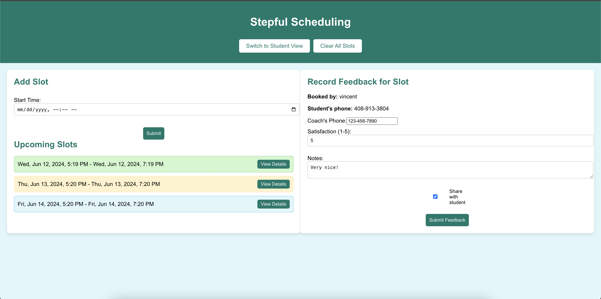
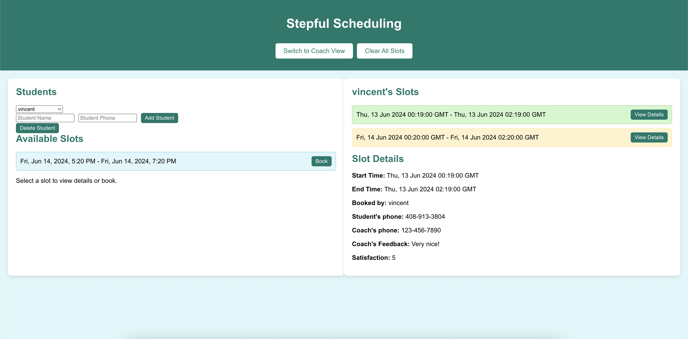

# Stepful Scheduling

Welcome to Stepful Scheduling! This project aims to manage 1-on-1 coaching calls between students and coaches efficiently. Below is the detailed information about the setup, functionalities, and features of the website.

## Technologies Used

- **Frontend:** React, TypeScript
- **Backend:** Flask
- **Database:** PostgreSQL

## Setup Instructions

### Prerequisites

Ensure you have the following installed on your system:

- Node.js
- Python 3.9+
- PostgreSQL
- npm (Node Package Manager)
- pip (Python Package Installer)

### Backend Setup

1. **Clone the repository:**
    ```bash
    git clone <repository-url>
    cd Stepful/backend
    ```

2. **Create and activate a virtual environment:**
    ```bash
    python -m venv venv
    source venv/bin/activate  # On Windows, use `venv\Scripts\activate`
    ```

3. **Install dependencies:**
    ```bash
    pip install -r requirements.txt
    ```

4. **Setup the database:**
    - Ensure PostgreSQL is running.
    - Create a new database named `stepful`.
    - Update the database URL in `backend/config.py`.

5. **Initialize and upgrade the database:**
    ```bash
    flask db init
    flask db migrate -m "Initial migration"
    flask db upgrade
    ```

6. **Run the Flask server:**
    ```bash
    flask run
    ```

### Frontend Setup

1. **Navigate to the frontend directory:**
    ```bash
    cd ../frontend
    ```

2. **Install dependencies:**
    ```bash
    npm install
    ```

3. **Start the React development server:**
    ```bash
    npm start
    ```

The frontend should now be running on `http://localhost:3000`.

## Site Functions and Features

### Coach Features

1. **Add Slots:**
   - Coaches can add slots of availability to their calendars. These slots are always 2 hours long and each slot can be booked by exactly one student.
   - Slots can be added using the "Add Slot" form in the coach view.

2. **View Upcoming Slots:**
   - Coaches can view their own upcoming slots in the calendar.
   - They can click on any slot to view its details.

3. **Record Feedback:**
   - After completing a call, coaches can record the student's satisfaction (an integer between 1-5) and write free-form notes.
   - Coaches can also choose to share their feedback with the student by checking the "Share with student" checkbox.

4. **Review Past Scores and Notes:**
   - Coaches can review their past scores and notes for all their calls in the slot details.

### Student Features

1. **Book Slots:**
   - Students can book upcoming, available slots for any coach.
   - Slots that are already booked by another student will not be available for booking.

2. **View Booked Slots:**
   - Students can view their booked slots in the "My Slots" section.

3. **View Coach and Student Details:**
   - Once a slot is booked, both the student and coach can view each other’s phone numbers.

4. **View Feedback:**
   - If the coach shares feedback, students can view the feedback details in the slot details.

### Additional Features

1. **Toggle Between Views:**
   - Users can easily switch between coach and student views using the "Switch to Student View/Coach View" button in the header.

2. **Manage Students:**
   - In the student view, users can add new students and delete existing student profiles.

3. **Clear All Slots:**
   - Coaches can clear all slots using the "Clear All Slots" button in the header.

4. **Chronological Sort:**
   - Events will be listed in chronological order based on date, regardless of when they were created.

### Website Screenshots


